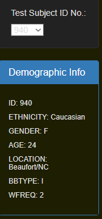
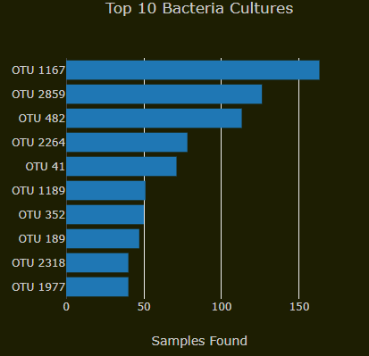
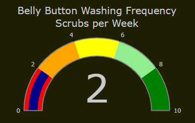
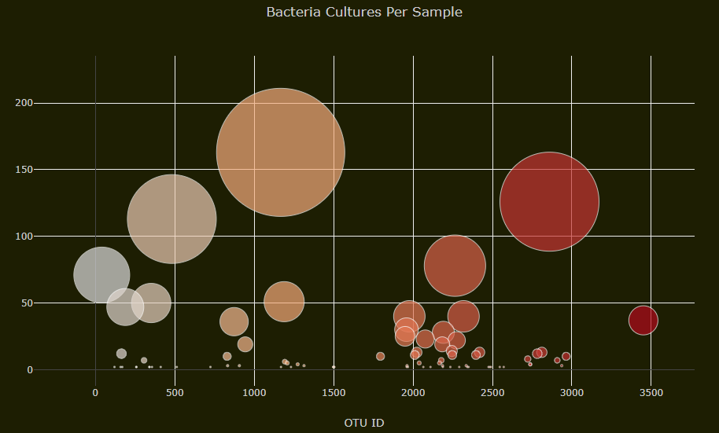

# Belly Button Bacteria Biodiversity

## Project Purpose
The purpose of this project is to create a webpage using JavaScript and HTML to display a variety of different plots and charts using the belly button bacteria data. A drop down menu will allow the user to select their own individual ID number and the page will automatically generate new charts for the specified ID. The plots will be created with the help of D3 and Plotly.

## Resources
- Software: 
	- JavaScript ES6+
	- D3 (Data-Driven Documents)
	- HTML/CSS
	- Bootstrap
	- Plotly
	
## The HTML page:

The page initially loads with the first test subject's information into the "Demographic Info" table and will also generate the following charts. The user can then use the drop down menu to switch between the different test subject ID numbers.

 

## GitHub Pages
To see the webpage in its entirety, visit: dannyvchu.github.io/bacteria
